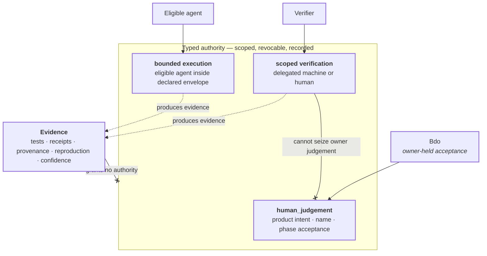

# Typed authority

```text
source          STATUS.yaml · PRD.md · CONTRACT.md
source_digest   8d31be110661b00b · f1157f2f1ebad6aa · ff6873d56338933b
reader          hand-authored · v2
fidelity        LOSSY
omissions       AuthorityGrant field shape (contracts/);
                scope, expiry, attenuation, and revocation mechanics;
                operation-specific authority checks
```



## What it shows

Confidence, tests, CI, receipts, and model judgement can produce evidence; they
do not mint standing or broaden authority. `STATUS.yaml` assigns owner-held
product intent, product naming, and phase acceptance to Bdo under
`human_judgement`. It separately gives eligible agents self-directed bounded
execution and delegated machines or humans scoped verification.

That split is why ordinary engineering work does not wait for approval while
owner-held settlement still cannot be impersonated. An agent may decide how to
repair a merge, strengthen a test, or implement inside its declared envelope;
it may not convert that engineering confidence into owner acceptance.

## Current boundary

The founding `O1`–`O22` docket is retired; those identifiers are not live open
questions anymore. `STATUS.yaml` currently records no open founding decisions.
The external public-clearance hold is distinct and blocks public release only,
not Phase-I engineering. Any new owner-held question must be routed through its
current decision record rather than resurrecting an `O<n>` identifier.
