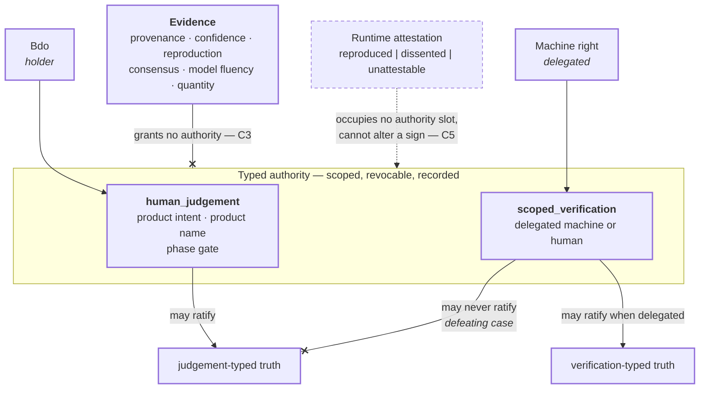

# Typed authority

```text
source          STATUS.yaml · PRD.md · CONTRACT.md
source_digest   5f595eece84ad085 · f1157f2f1ebad6aa · 896e59ba90828ad7
reader          hand-authored · v1
fidelity        LOSSY
omissions       AuthorityGrant field shape (contracts/);
                scope and revocation mechanics;
                the judgement-budget queue, drawn in requirement-lifecycle.md
```



## What it shows

Two typed slots, and the line between them is the one `PRD.md` PROD-I-5 names a
defeating case for: **a machine right ratifying judgement-typed truth**. A
machine may ratify verification-typed truth when that right has been delegated.
It never crosses into judgement.

The blocked arrow from evidence is `CONTRACT.md` C3, and it is the invariant
most likely to be violated by accident. A well-provenanced, reproduced,
consensus-backed, fluently-argued claim has exactly as much authority as a
sloppy one: none. Authority is explicitly typed, scoped, revocable, and
recorded, or it does not exist.

Attestation is drawn off to the side because it reports rather than rules. It
says `reproduced`, `dissented`, or `unattestable`, changes current
effectiveness, and cannot touch a historical sign (`CONTRACT.md` C5).

## How the first grant is founded

The diagram shows the steady state. It does not show the bootstrap, which
decision 0024 settled: the first attestor is admitted by a founding
`BootstrapGrant` accepted by the owner and pinned to an exact attestor identity,
validator version, capability, scope, validity, and artifact revision. It may
attest verification-typed claims only and can never ratify judgement. Every
later attestor resolves through ordinary authority and identity lineage.

Bootstrap is finite and explicit, not ambient root permission — which is why it
is drawn nowhere on this canvas rather than as a box above `Bdo`.
