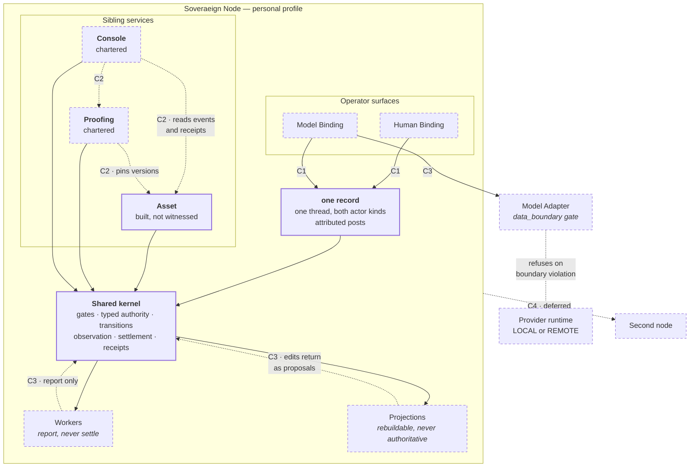

# Crossing topology

```text
source          SPEC.md · services/console/CHARTER.md · STATUS.yaml ·
                CONTRACT.md
source_digest   274a3669df8144cf · f428009efe2e1080 ·
                41d658f0917e606a · 896e59ba90828ad7
reader          hand-authored · v1
fidelity        LOSSY
omissions       the class definitions and shared obligations, held by
                crossing-typology.md;
                service internals and component structure, held by service-map.md;
                transition preconditions and reason codes, held by SPEC.md;
                every requirement predicate's positive and defeating fixture pair
```

Which crossings exist, and where. The classes `C1`–`C4` are fixed in
`crossing-typology.md`; this view places them. No edge here is built on both
ends, so every crossing is drawn in pencil.



## What it shows

Every arrow reaching authoritative state passes **through** the kernel. That is
`CONTRACT.md` C1, and on this canvas it is the only structural rule that holds
without exception: no binding, adapter, worker, projection, or sibling service
has an edge that reaches around it. A surface that bypasses the kernel fails
Phase I outright (`PRD.md`, two-binding proof).

Three edges are drawn dotted **back** toward the kernel rather than into it,
and the direction is the point:

- a worker **reports**; independent observation and kernel settlement decide
  whether the run committed;
- a projection-originated edit **returns as a proposal**, it is not a write;
- an adapter that fails its data boundary **refuses**, and the refusal carries
  a receipt like any other terminal outcome.

C1 is the only class where two edges land on the same object. A human post and
a model post in one thread are one crossing through one record
(`services/console/CHARTER.md`), which is exactly what `PRD.md` PROD-I-3 asks
for: a fact deposited by one is retrieved and used by the other, with origin and
projection visible, and the crossing returns a receipt.

## Where the far side is a third party

Only `C3` egress leaves the node. `MB → MA → PV` is the sole path on this
canvas that can put bytes in front of someone else, and it is the only path
carrying a `data_boundary` — `LOCAL_ONLY`, `REDACTED_REMOTE`, or
`REMOTE_ALLOWED`.

Two obligations land there and nowhere else. Provider loss must leave
authoritative custody and non-model local operation intact, so `PV` vanishing
may not disturb anything inside the node boundary. And fallback to another
model is never silent — an `EXPLICIT` fallback requires a **new** attributed
invocation and receipt naming the replacement binding (`SPEC.md`
`ModelBinding`).

`C4` is drawn from the node boundary rather than from any component inside it.
A federation crossing is between nodes, not between a service here and a
service there. It is a Phase-I non-goal and stays a stub until
`ENGINEERING.md`'s growth trigger fires — two nodes actually needing to exchange
governed records, at which point identity, policy, and receipt contracts are
owed before the edge is drawn solid.

## Pencil, and why

Only `Asset`, the kernel, and the shared record are pen, and even that is
generous: `STATUS.yaml` records Asset as `BUILT_SELF_TESTED_NOT_WITNESSED`, and
built is not witnessed.

Every crossing edge is dashed, because **no crossing on this canvas is built on
both ends**. `bindings/` and `adapters/` hold README files and a profile
skeleton; no adapter executes, so no `C3` egress has ever run. Proofing and
Console are charters, so no `C2` edge has a live reader or a live writer.
Federation is deferred.

## Open

The conformance oracle validates `C1` against hand-authored control fixtures
only. Binding it to the reference participant currently yields no matches —
the oracle expects `CONF-I*` case identifiers and the Asset Service emits
`RUN-I*` — which `STATUS.yaml` carries honestly as
`conformance_status: EXECUTABLE_ORACLE_CONTROLS_PARTICIPANT_BINDING_OPEN`.
Until that binding closes, no crossing on this canvas has been observed
end to end by anything other than its own author.
