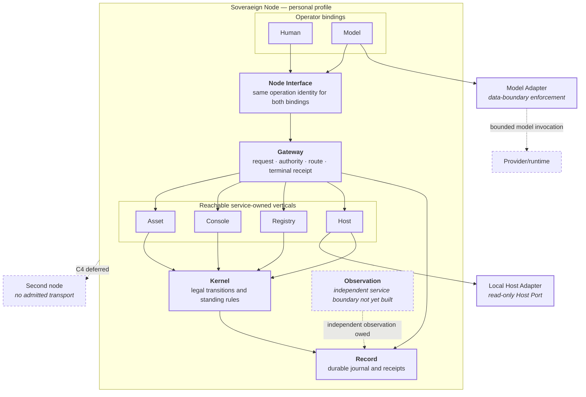

# Crossing topology

```text
source          SPEC.md · services/console/CHARTER.md · STATUS.yaml · CONTRACT.md
source_digest   ea07f0ec39b9a551 · 02597585b1a5c956 · 8b14456526261e02 · f95acd076c4977d7
reader          hand-authored · v2
fidelity        LOSSY
omissions       crossing class definitions, held by crossing-typology.md;
                service internals, held by service-map.md;
                exact preconditions and refusal codes, held by contracts;
                all unreachable declared operations
```

This view places the crossings that now have executable paths without promoting
self-test evidence into observation.



## What changed from the founding sketch

A Human and a Model binding can now resolve the **same** Node operation and
cross the same Gateway route semantics. The horizontal composition includes
service-owned routes for Asset, Console, Registry, and Host; the Node Interface
currently derives five reachable operations. The Host `read-health` route ends
at a read-only injected Host Port rather than an arbitrary shell path.

Those executable edges are not witness marks. The projection records **zero
observed operations**. The existing Gateway observation candidate exercises an
Asset crossing and tests spoofed/tampered provenance; it does not independently
observe Host. Observation remains a separate boundary precisely so a routed
service receipt cannot certify itself.

Console still consumes the shared durable record to reconstruct its operator
objects. Gateway now gives the actor-facing read route a governed crossing, but
that does not magically convert every internal package relation into a new
service protocol. The drawing therefore distinguishes executable composition
from independent observation rather than calling every solid edge settled.

## External and deferred crossings

The Model Adapter is separate from the Human/Model Node-operation parity path.
It enforces the declared model data boundary for BYOM/runtime invocation; model
provider credentials are mechanism, never SOV authority. Federation remains a
Node-to-Node crossing with no admitted transport in the current baseline. A peer's evidence may later
cross a Surface, but the peer Root's authority may not silently become local
authority.
