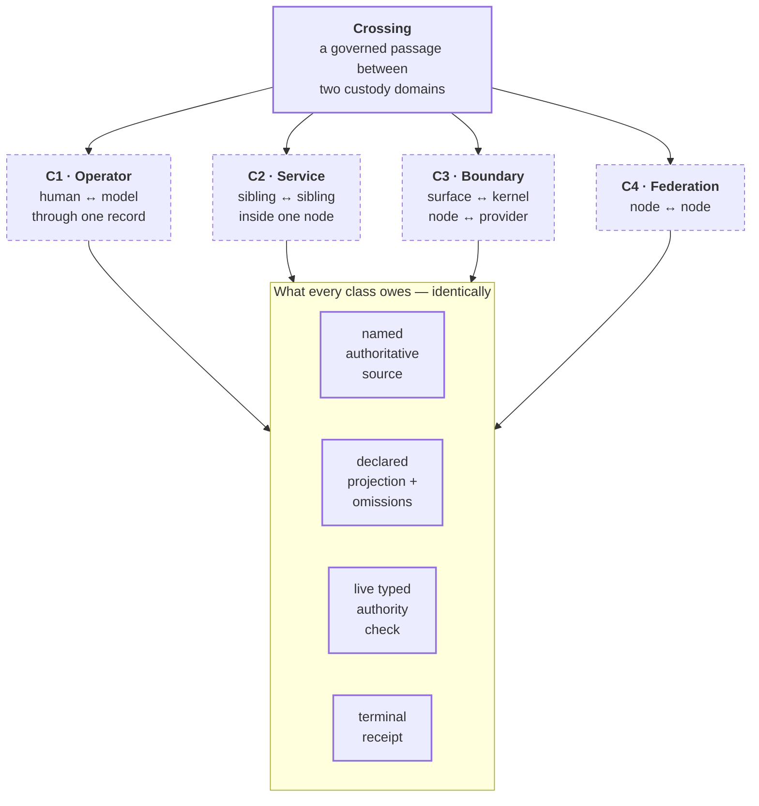

# Crossing typology

```text
source          SPEC.md · CLASSIFICATION.md · PRD.md · CONTRACT.md
source_digest   274a3669df8144cf · 69f361e837dceebe ·
                641281625d74b53a · 896e59ba90828ad7
reader          hand-authored · v1
fidelity        LOSSY
omissions       the receipt and event-envelope field lists, held by SPEC.md and
                contracts/*.schema.json;
                per-class refusal reason codes beyond the four named below;
                the topology of where each class occurs, held by
                crossing-topology.md;
                federation identity and policy contracts, which do not exist
```

`receipts_for_crossings` is a settled source claim. Which passages count as
crossings, and what each owes, is proposed, so the classes are drawn in pencil.



## What it shows

The four classes differ in **what sits on the far side**. They do not differ in
**what the passage owes**. That is the whole claim of this view, and it is why
one typology is worth drawing rather than four unrelated pictures.

A crossing is not merely a call. It is a passage where a fact leaves one
custody domain and arrives in another, and the arrival must be reconstructable
from the record alone. `SPEC.md` gives the `cross` transition exactly one
precondition set — declared source, reader or projection, omissions, authority,
destination — and exactly one commit: a destination record **and** a receipt.

## The four classes

| Class | Traverses | Far side | Phase-I standing |
| --- | --- | --- | --- |
| **C1 · Operator** | one record, two actor kinds | a `HUMAN` or `MODEL` operator | required — `PRD.md` PROD-I-3 |
| **C2 · Service** | a declared service contract | a sibling service in the same node | one direction chartered |
| **C3 · Boundary** | a binding, adapter, worker, or projection | the kernel, or a named external runtime | partly built |
| **C4 · Federation** | a governed node-to-node crossing | a second sovereign node | deferred, non-goal |

`Subsystem` is the generic architectural class and is not a level between
service and component (`CLASSIFICATION.md`). None of these classes creates a
new authority path; each is a passage **through** the kernel, never around it.

## What every crossing owes

Four obligations, and they are the same four in every class:

| Obligation | Where it is fixed | Defeating case |
| --- | --- | --- |
| Name the authoritative source and version | `SPEC.md` `cross` preconditions | the crossing cannot name its source |
| Declare the reader or projection, and its omissions | `SPEC.md` Projection rule | a projected value resolves to nothing |
| Check a live typed, scoped, budgeted grant | `PRD.md` PROD-I-5 | a machine right ratifies judgement |
| Return one terminal receipt | `PRD.md` PROD-I-4 | an unmarked entry is admitted |

The receipt is owed **even when the crossing refuses**. `SPEC.md` is explicit
that a receipt is attributable and addressable on refusal, failure, unresolved
judgement, dissent, and counteraction. A silent crossing is a defect regardless
of class.

## What differs between classes

Only two things, and both are about loss:

**What can be lost.** C1 loses nothing outside the node. C3 is the only class
that can put bytes in front of a third party, which is why it is the only class
carrying a `data_boundary` — `LOCAL_ONLY`, `REDACTED_REMOTE`, or
`REMOTE_ALLOWED` (`SPEC.md` `ModelBinding`). C4 would be the second such class
if it existed.

**What survives the far side vanishing.** `PRD.md` PROD-I-9 requires that
provider loss leaves authoritative custody and non-model local operation
intact. That obligation lands entirely on C3. C1 and C2 have no far side to
lose — both are inside one node, and losing the node is not a crossing failure.

## Pencil, and why

Every class is dashed. C1 depends on `SPEC.md`, which is `PROPOSED` and pending
O10. C2 has one chartered direction and no implementation on either end of it.
C3 exists as `bindings/` and `adapters/` directories that hold README files and
a profile skeleton — no adapter executes. C4 is a Phase-I non-goal and a
`ROADMAP.md` deferral.

The four obligations are drawn in pen. They are downstream of settled source
claims — `receipts_for_crossings`, `typed_scoped_revocable_authority`,
`evidence_does_not_grant_authority` — not of any proposed class boundary. A
future class would inherit them unchanged; that is the point of fixing them
once here.
