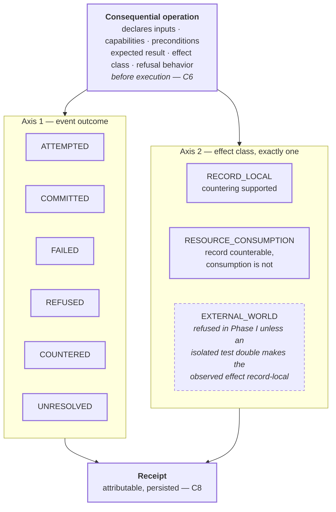

# Event outcome and effect class

```text
source          CLASSIFICATION.md · SPEC.md · CONTRACT.md
source_digest   b034a56c7cf90000 · b58dc1ed68c2b999 · f95acd076c4977d7
reader          hand-authored · v1
fidelity        LOSSY
omissions       EventEnvelope and Receipt field shapes (contracts/);
                reason codes for refusal;
                receipt persistence and retention rules
```

Outcome and effect class are **two independent axes** of one recorded event.
Reading them as a single status is the mistake this view exists to prevent.



## What it shows

Every consequential operation declares its shape **before** it runs — inputs,
required capabilities, preconditions, expected observable result, effect class,
and refusal behavior (`CONTRACT.md` C6). Declaring after the fact is not
declaring.

Every crossing returns a receipt, and that includes the unhappy paths:
admission, refusal, action, failure, unresolved judgement, attestation,
retraction, and counteraction all produce attributable records
(`CONTRACT.md` C8). A refusal that leaves no receipt is a silent failure
wearing a policy costume.

`COUNTERED` appears here, on the outcome axis, and deliberately **not** in the
standing chain — see `standing-transition.md`.

## The Phase-I line

`EXTERNAL_WORLD` is drawn in pencil because Phase I refuses it. `STATUS.yaml`
carries `no_real_external_world_effects_in_phase_i` as a protected boundary, and
decision 0024 settled what happens after: isolated test doubles are admitted
only while their observable effect is record-local, and later phases use forward
compensation — record the external occurrence, the attempted remedy, and what
remains changed or consumed. Never claim world rollback. Anything that reaches
outside the local record today refuses visibly and leaves a receipt saying so.
