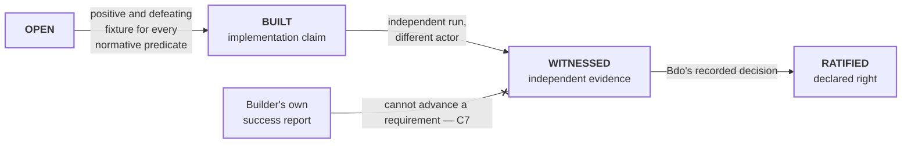

# Requirement lifecycle

```text
source          PRD.md · SPEC.md · CONTRACT.md · STATUS.yaml
source_digest   641281625d74b53a · 274a3669df8144cf · 896e59ba90828ad7 · e701388223866b3d
reader          hand-authored · v1
fidelity        LOSSY
omissions       the nine PROD-I requirement texts and their defeating cases;
                per-requirement current standing, which STATUS.yaml does not
                yet record requirement by requirement
```



## What it shows

`BUILT` is a claim, not a result. Passing self-authored unit tests gets a
requirement to `BUILT` and no further. `WITNESSED` needs an independent run;
`RATIFIED` needs the declared right. No agent advances a requirement on its own
report.

The blocked arrow is `CONTRACT.md` C7 — an executor's success report is not
evidence that the world changed. Settlement uses an observer that can inspect
world state without relying on the executor's account. In this repository's
harness that is enforced structurally: the agent that builds and the agent that
witnesses are never the same agent.

## Where the work actually sits

`STATUS.yaml` records `asset_service_status: BUILT_SELF_TESTED_NOT_WITNESSED`
and `engineering_framework_status: BUILT_SELF_TESTED_NOT_WITNESSED_BASELINE_PROPOSED`.
Both are parked at exactly the `BUILT → WITNESSED` seam, which is the seam this
diagram exists to make unmissable.

Phase I exits only when every normative predicate has both fixtures, the
fixtures run against two bindings, independent observation can reconstruct the
receipts, open judgement calls are visible, and Bdo ratifies operational
acceptance.
