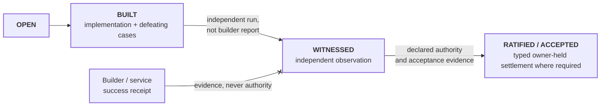

# Requirement lifecycle

```text
source          PRD.md · SPEC.md · CONTRACT.md · STATUS.yaml
source_digest   f1157f2f1ebad6aa · 108497d370c0fd8d · 896e59ba90828ad7 · 8d31be110661b00b
reader          hand-authored · v2
fidelity        LOSSY
omissions       the nine PROD-I requirement texts and their defeating cases;
                per-operation evidence, held by service tests and observation records
```



## What it shows

A passing participant test or terminal service receipt can establish build
evidence; neither can award itself WITNESSED standing. Independent observation
must reconstruct the relevant predicate without relying on the executor's
claim. Where settlement belongs to the owner, the human gate is **acceptance,
not preapproval**.

The current repository makes this distinction concrete. Asset and Record remain
built/self-tested rather than self-witnessed. Host `read-health` is also built
and self-tested, while its Node Interface fact is explicitly `observed: false`.
The engineering framework itself is owner-accepted as the Phase-I reference
baseline; that acceptance does not convert every implementation beneath it into
witnessed behavior.

The derived operation surface currently says 127 declared, 5 reachable, and 0
observed. That is not a health score. It is three independent layers of fact,
and the lifecycle must not collapse them into one percentage.
