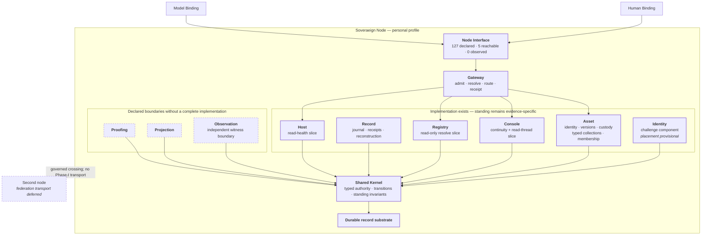

# Service map

```text
source          CLASSIFICATION.md · STATUS.yaml · CONTRACT.md · services/README.md
source_digest   b034a56c7cf90000 · 10bd4f7e6541b52c · ff6873d56338933b · d5a11f10339de0c2
reader          hand-authored · v3
fidelity        LOSSY
omissions       each service's internal components and full operation list;
                exact standing evidence, held by STATUS.yaml and service records;
                crossing reason codes, held by SPEC.md and service contracts
```



## What it shows

The service row is no longer the original three-box sketch. The repository now
carries ten service manifests, and implementation exists for Asset, Record,
Console, Gateway, Registry, Host, and an Identity challenge component. Proofing,
Projection, and independent Observation remain declared boundaries rather than
completed service implementations.

The five reachable Node operations are a narrower fact than “these services are
built.” Reachability is derived from the exact policy-active route surface;
standing remains separate. The current Node Interface records **127 declared,
127 bound, 39 policy-active, 5 reachable, and 0 observed**. In particular,
Host `read-health` is reachable and self-tested but not independently observed.

All actor-facing action enters through the same Node Interface and Gateway
composition rather than giving Human and Model bindings private service paths.
Gateway may route to a service; it does not acquire that service's semantics or
standing.

## Standing seams remain visible

The tree has moved faster than several standing summaries. `STATUS.yaml` still
contains deliberately conservative or contradictory readings for some partial
services, notably Gateway, while `services/README.md` records built slices.
This diagram does not settle those records by appearance. Solid boxes mean
implementation exists in the current tree; they do **not** mean WITNESSED or
owner-accepted standing.

Identity remains especially explicit: its challenge component is built, while
whether Identity is ultimately a service boundary is still a product-placement
question carried by its own decision record. Federation remains transport-free
in Phase I.
