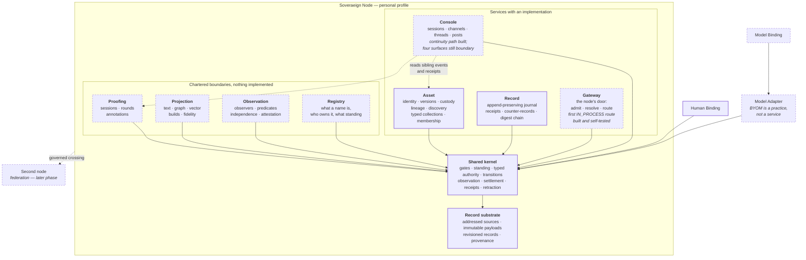

# Service map

```text
source          CLASSIFICATION.md · STATUS.yaml · CONTRACT.md · services/README.md
source_digest   e5fc283e55782245 · c141d6f181709311 · 896e59ba90828ad7 · 37334eea4bb44f95
reader          hand-authored · v2
fidelity        LOSSY
omissions       each service's internal components;
                the crossing contract's operations and reason codes;
                every service's declared operations, held by
                services/<name>/contracts/service.json;
                Atlas, Gauge, definition, and pedagogy, which are concerns
                until evidence earns one a service boundary
```



## What it shows

Eight sibling services in **one** local node, all resolving through the same
shared kernel. None of them is independently a federation, node, platform, or
complete product.

The arrows into the kernel are the whole point of `CONTRACT.md` C1: no
interface — human binding, model binding, adapter, worker, or projection — may
write authoritative state around it. A surface that bypasses the kernel fails
Phase I outright (`PRD.md`, binding parity).

Console reads sibling events and receipts through a declared crossing. It does
not hold, infer, or delegate authority.

Record Service and record substrate are not the same box. The substrate is
where addressed bytes and revisioned records live. The Record Service is the
participant that owns the append-preserving journal on top of it, and it
refuses to journal a governing document, so the design System of Record and the
operational one cannot quietly merge (`services/record/CHARTER.md`).

## Pencil, and why

`STATUS.yaml` is the authority on which box is drawn in pen:

| Service | `STATUS.yaml` | Drawn |
| --- | --- | --- |
| Asset | `BUILT_SELF_TESTED_NOT_WITNESSED` | pen |
| Record | `BUILT_SELF_TESTED_NOT_WITNESSED` | pen |
| Console | `BUILT_CONTINUITY_PATH_SELF_TESTED_REMAINDER_BOUNDARY` | pencil |
| Proofing | `OWNER_ACCEPTED_BOUNDARY_NOT_IMPLEMENTED` | pencil |
| Projection | `OWNER_ACCEPTED_BOUNDARY_NOT_IMPLEMENTED` | pencil |
| Gateway | `CHARTERED_BOUNDARY_NOT_IMPLEMENTED`, which disagrees with the tree | pencil |
| Observation | `CHARTERED_BOUNDARY_NOT_IMPLEMENTED` | pencil |
| Registry | no `STATUS.yaml` field; charter reads `PROPOSED` | pencil |

Gateway is the other awkward one, and for a different reason. `services/gateway/src`
and `services/gateway/tests` exist and `services/README.md` reads "first IN_PROCESS
route pattern built and self-tested", but `STATUS.yaml` still reads
`CHARTERED_BOUNDARY_NOT_IMPLEMENTED`. The slice landed without its standing moving
with it, on `feat/federation-harness-and-hardening` before main and that branch were
reconciled. The box is drawn where the tree puts it and in pencil, because pencil is
the reading that cannot mislead either way. Which of the two records is wrong is the
gateway domain's to settle with its own evidence; `OPEN-SEAMS.md` S23 holds it.

Console is the awkward one and is drawn in pencil deliberately. Its continuity
path — channels, threads, posts, operator sessions and grants — is implemented
and self-tested, so part of the box is real. The other four operator surfaces
are text. A half-solid outline would claim a precision this convention does not
have, and pencil is the reading that cannot mislead: built is not witnessed,
and partly built is not built.

Registry has a charter and a thirteen-operation manifest but no row in the
`services/README.md` table and no standing field in `STATUS.yaml`. That gap is
the Registry Service's own thesis about hand-maintained tables, observed on
itself.

`Model Binding` and `Model Adapter` are drawn outside the service rows on
purpose. BYOM is a model-selection practice; a binding realizes an operator
interface and an adapter translates to a runtime or provider. Neither owns
authoritative state, and neither gains authority from provider credentials.
