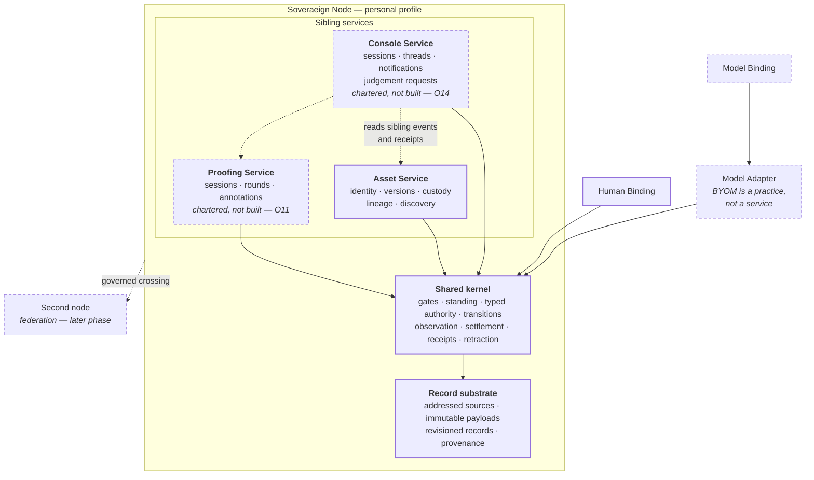

# Service map

```text
source          CLASSIFICATION.md · STATUS.yaml · CONTRACT.md
source_digest   23a2826915e3143a · e701388223866b3d · 896e59ba90828ad7
reader          hand-authored · v1
fidelity        LOSSY
omissions       each service's internal components;
                the crossing contract's operations and reason codes;
                Atlas, Gauge, definition, pedagogy, and observation, which are
                concerns until evidence earns one a service boundary
```



## What it shows

Three sibling services in **one** local node, all resolving through the same
shared kernel. None of them is independently a federation, node, platform, or
complete product.

The arrows into the kernel are the whole point of `CONTRACT.md` C1: no
interface — human binding, model binding, adapter, worker, or projection — may
write authoritative state around it. A surface that bypasses the kernel fails
Phase I outright (`PRD.md`, two-binding proof).

Console reads sibling events and receipts through a declared crossing. It does
not hold, infer, or delegate authority.

## Pencil, and why

Only Asset Service has an implementation, and `STATUS.yaml` records it as
`BUILT_SELF_TESTED_NOT_WITNESSED` — built is not witnessed. Proofing and
Console are charters behind O11 and O14. Federation is a later phase and a
Phase-I non-goal.

`Model Binding` and `Model Adapter` are drawn outside the service row on
purpose. BYOM is a model-selection practice; a binding realizes an operator
interface and an adapter translates to a runtime or provider. Neither owns
authoritative state, and neither gains authority from provider credentials.
