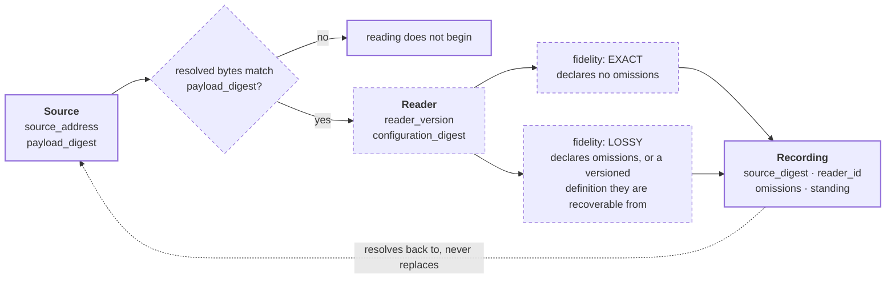

# Source, Reader, Recording

```text
source          SPEC.md · CONTRACT.md
source_digest   b58dc1ed68c2b999 · ff6873d56338933b
reader          hand-authored · v1
fidelity        LOSSY
omissions       full field lists for Source, Reader, and Recording;
                payload custody and addressing mechanics;
                the Proposal object, which enters this flow separately
```

`sources_survive_reading` is a settled source claim. The field lists that
realize it are proposed, so they are drawn in pencil.



## What it shows

A reading never mutates its source (`CONTRACT.md` C2). The derivation produces
a **new** recording that carries enough to recover the source, the reader, the
reader version, the configuration, and whether the read was exact or lossy.

The digest gate is the part prose keeps burying: bytes resolved by
`source_address` must match `payload_digest` **before** a reading begins. A
read that skips the gate produces a recording whose provenance is a guess.

`EXACT` and `LOSSY` are not quality grades. `LOSSY` is a legitimate, declared
mode — it is only a defect when the omissions go undeclared. Every diagram in
this directory is a `LOSSY` recording of a document.

## Why it matters here

This is the flow the owner's library itself has to obey. A generated deck is a
`LOSSY` reading of the governing corpus, so it owes a declared omission set and
a `source_digest` that can go stale detectably.

Defeating case, from `PRD.md` PROD-I-2: a source rereads differently, or a
recording cannot resolve its source and reader.
