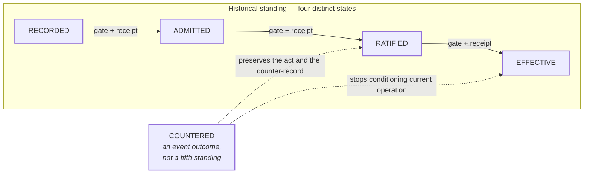

# Standing and counteraction

```text
source          CLASSIFICATION.md · CONTRACT.md
source_digest   bcb1a15f28ccb530 · 896e59ba90828ad7
reader          hand-authored · v1
fidelity        LOSSY
omissions       the specific gate and receipt required at each step;
                retention and persistence rules for receipts;
                attestation outcomes, which are drawn in event-outcomes.md
```



## What it shows

Four states, and **no step is automatic**. Each transition requires its own
declared gate and its own receipt. Admission does not ratify. Ratification does
not prove current applicability (`CONTRACT.md` C4).

`COUNTERED` sits deliberately outside the chain. It is an event outcome that
prevents an earlier effective record from continuing to condition current
operation, while preserving both the act and the counter-record. Drawing it as
a fifth box in the row would say the opposite of what the corpus says — which
is why `CLASSIFICATION.md` states the point twice.

Retraction preserves occurrence. It never claims reversal of resource
consumption or external-world mutation (`CONTRACT.md` C9).

## Where the corpus sits on this chain today

Almost everything in this repository is `RECORDED` or `ADMITTED`, and the
governing documents no longer sit together. `STATUS.yaml` records
`classification_status: OWNER_ACCEPTED_CANONICAL_VOCABULARY` and
`specification_status: OWNER_ACCEPTED_PHASE_I_LOGICAL_SPEC_WITH_SOVEREIGNTY_CLARIFICATION`
(decision 0024, rulings on classification vocabulary and the Phase-I logical
specification). `CONTRACT.md` has no acceptance field and its own header still
reads `PROPOSED FOR OWNER RATIFICATION`.

Both `CLASSIFICATION.md` and `SPEC.md` also still carry `PROPOSED` in their own
headers, and that is not automatically a contradiction. An acceptance field
names the version Bdo accepted; the file on disk has kept moving since. For
`SPEC.md` the movement is named — `decisions/0034` adds two refusal codes to
the transition contract and sits in `STATUS.yaml` under `unruled_proposals` —
so its header describes a document that changed after acceptance rather than an
acceptance that never happened. Flipping it would claim a ratification nobody
gave.

`CLASSIFICATION.md` carries no equivalent note, so whether its header is simply
stale is open and unruled. `CONTRACT.md` has no acceptance field at all. This
view reports the three states and rules on none of them.
