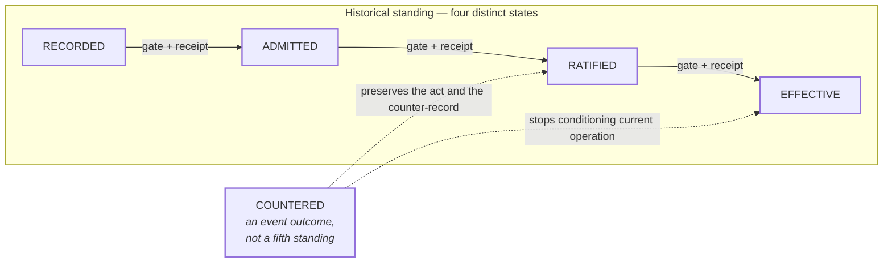

# Standing and counteraction

```text
source          CLASSIFICATION.md · CONTRACT.md
source_digest   23a2826915e3143a · 896e59ba90828ad7
reader          hand-authored · v1
fidelity        LOSSY
omissions       the specific gate and receipt required at each step;
                retention and persistence rules for receipts;
                attestation outcomes, which are drawn in event-outcomes.md
```



## What it shows

Four states, and **no step is automatic**. Each transition requires its own
declared gate and its own receipt. Admission does not ratify. Ratification does
not prove current applicability (`CONTRACT.md` C4).

`COUNTERED` sits deliberately outside the chain. It is an event outcome that
prevents an earlier effective record from continuing to condition current
operation, while preserving both the act and the counter-record. Drawing it as
a fifth box in the row would say the opposite of what the corpus says — which
is why `CLASSIFICATION.md` states the point twice.

Retraction preserves occurrence. It never claims reversal of resource
consumption or external-world mutation (`CONTRACT.md` C9).

## Where the corpus sits on this chain today

Almost everything in this repository is `RECORDED` or `ADMITTED`. `CONTRACT.md`,
`SPEC.md`, and `CLASSIFICATION.md` are proposed and awaiting owner ratification
(O9, O10). That is the whole reason the pencil-and-pen convention exists.
